# 如何给开源社区贡献代码

## 前言
练习提交第一个`PR`，这对于开源新手来说会是一个很好的开始，对`git`不是很熟悉，但希望参与到开源社区中的小伙伴，可以参考下文教程，`fork`本仓库进行`git`提交练习。

可以轻松的提交任何东西，不必担心产生错误，这只是一个练习`git`的流程。

放轻松，迈出开源的第一步。

## 一、fork 社区仓库

打开你想参与贡献的社区的仓库的 `github` 页面，并且 `fork` 这个仓库

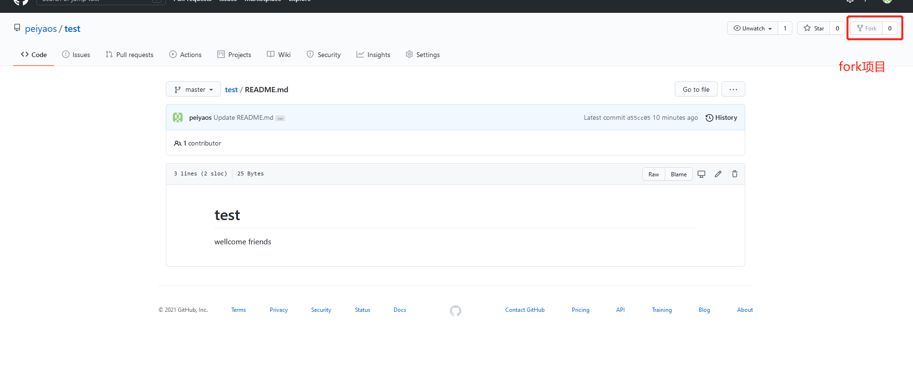

打开你自己的 `github` 页面，此时应该会多一个仓与你刚 `fork` 的仓库同名

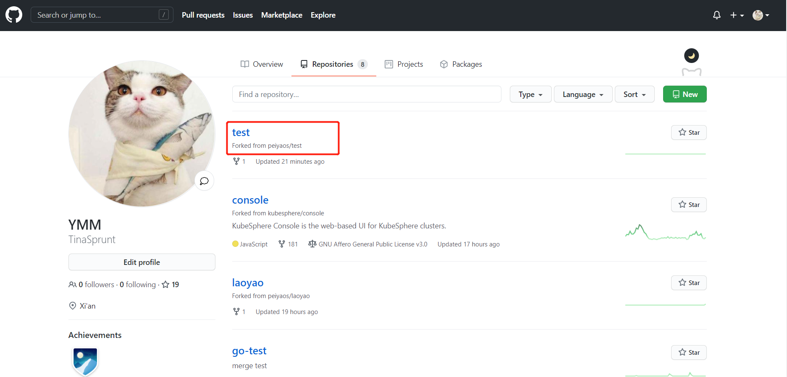


## 二、更新fork仓库与社区仓库同步

> 官方仓：你想要贡献的项目的官方仓库地址
> 远程仓：你 fork 下来之后，在你的 github 页面上那个与官方仓同名的仓库地址
> 本地仓：git clone 远程仓之后下载到你本地的代码仓地址


刚 `fork` 下来的不用，`fetch upstream` 按钮点击后会显示你与官方仓是一致的，不需要更新。就像这样（或者点击Sync fork也可以）

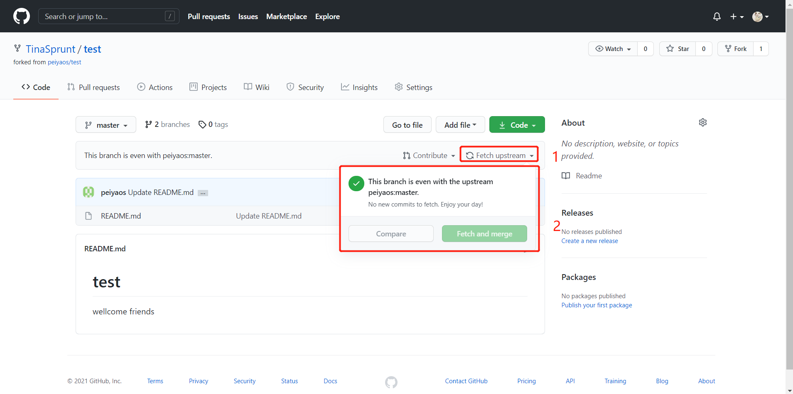

如果是已经 `fork` 了一段时间的，官方可能已经进行了很多修改，与你 `fork` 下来的时候不一样了，就需要 `fetch upstream` 查看官方更新，点击 `fetch and merge` 按钮进行同步

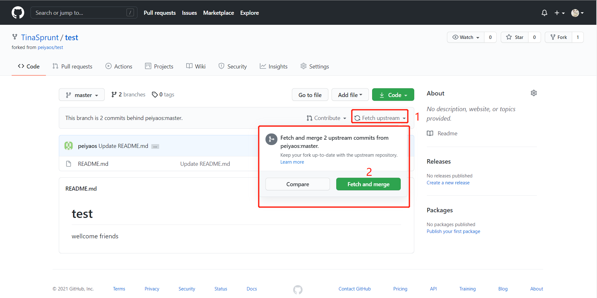

命令行同步方式，等价于上面的界面操作，**二选一即可**，小白建议直接点界面

```git
# 克隆fork到自己github的代码仓
git clone git@github.com:TinaSprunt/test.git

# 检查remote信息
git remote -v
```

```git
# 添加官方仓地址
git remote add upstream https://github.com/peiyaos/test.git
```
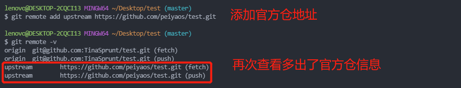
```git
# 拉取官方仓文件，进行同步
git fetch upstream
```
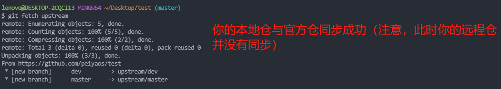
```git
# 将你已经同步好的本地仓push到你的远程仓
git merge upstream/master
```
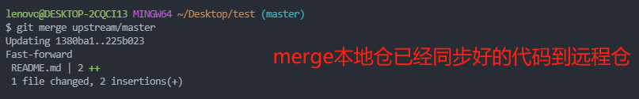

此时本地仓、远程仓、官方仓三者就处于一致状态了，可以进行开发了

同步流程关系简单画了个图，辅助理解：
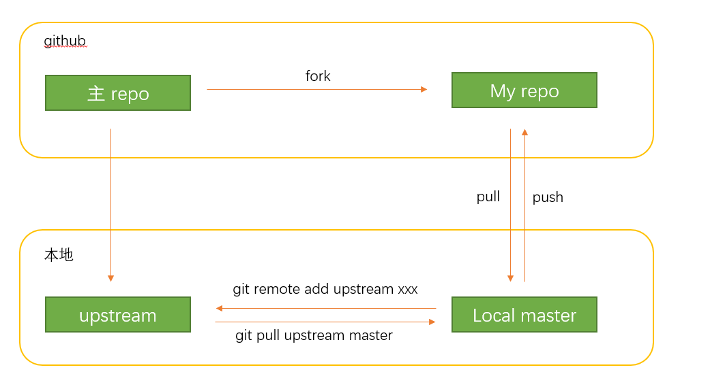

## 三、新建开发分支进行开发
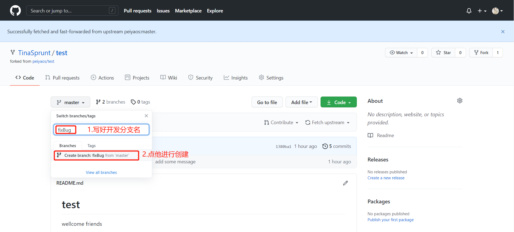

命令行新建分支方式，等价于上面的界面操作，**二选一即可**，小白建议直接点界面
```git
# 新建分支
git checkout -b fixBug

# 推送该分支到远程仓
git push -u origin fixBug
```
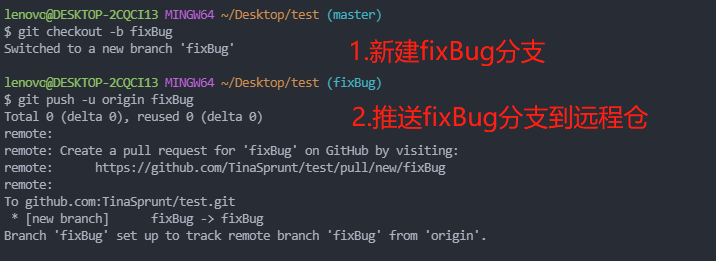

此后是代码开发balabala……

## 四、开发分支本地开发完成后push到远程仓
```git
# 查看修改了那些文件
git status

# 查看修改内容
git diff

# add 提交
git add .

# commit 提交（如果官方仓需要Signed-off-by检查的就带账号邮箱信息）
git commit -m "xxxxx" -s

# push到远程仓
git push origin
```
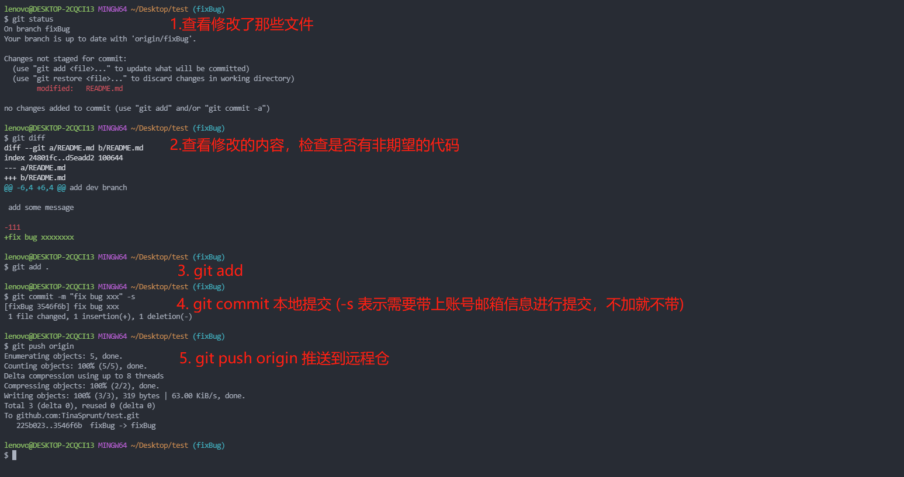

## 五、向官方仓提交PR
打开你自己的github页面的对应远程仓，会有出现可合并的分支提示
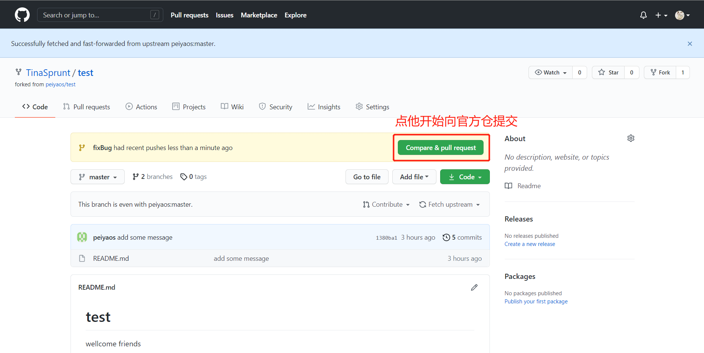
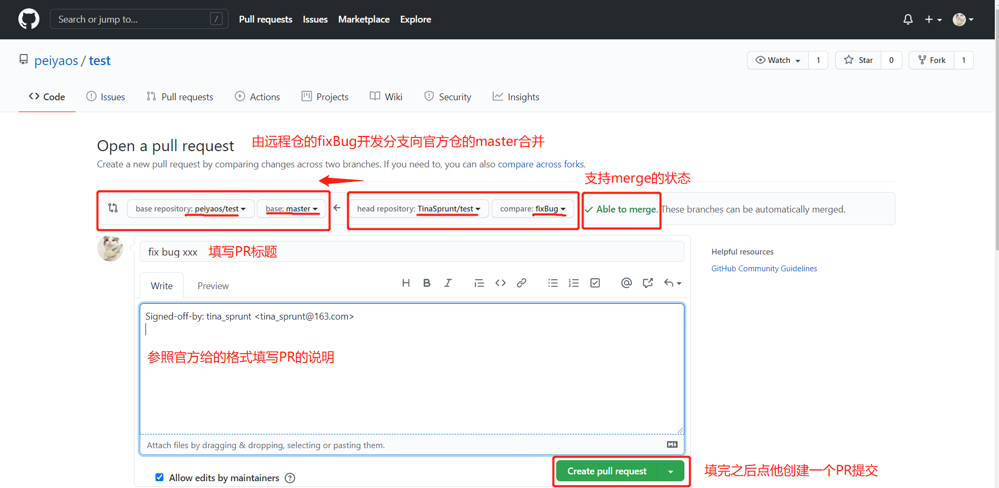


各家的PR说明格式要求不同，可以前往官方仓查看他的贡献指南，一般会给出示例模板。

举个栗子，以下是 `kubesphere console` 的PR说明模板（修复1543 issuse）：
```yaml
**What type of PR is this?**
/kind bug

**What this PR does / why we need it**:
rename the button 'Rerun' to 'Run' on the b2i page #1543

**Which issue(s) this PR fixes**:
Fixes  #1543

**Special notes for reviewers:**

**Additional documentation, usage docs, etc.:**

```


## 六、提交PR之后
提交PR之后，可以前去官方仓查看审查情况

比如这种是官方仓没有机器人检查的
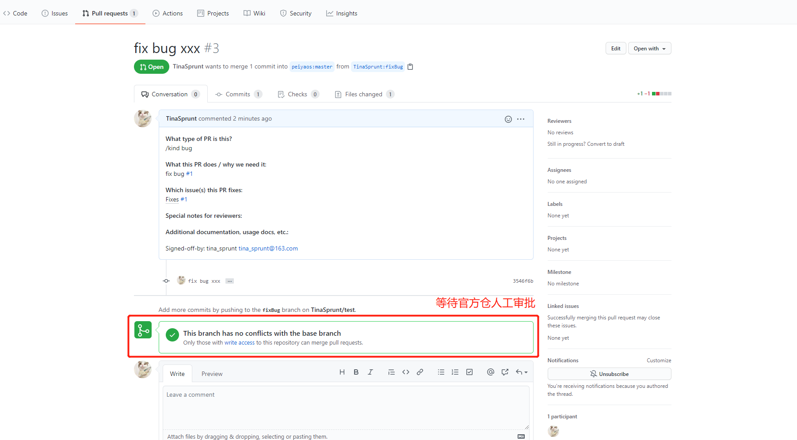

比如这种是有静态检查的,需要全部变绿√才算成功，黄色是处理中需要等待，红色则是你提交的代码还有问题，需要重新修改
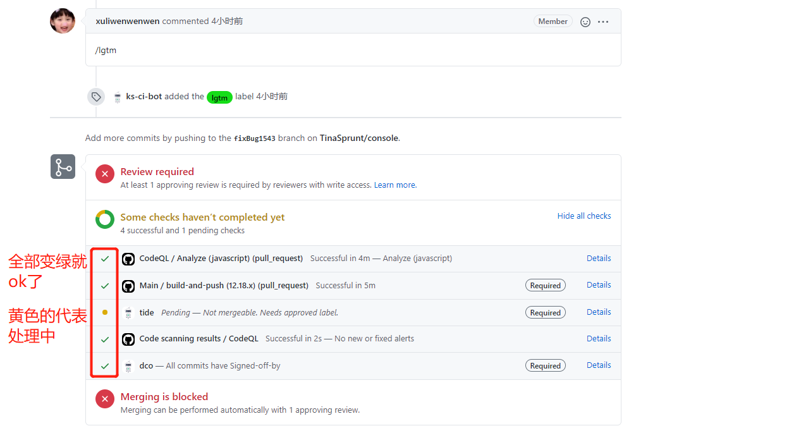

比如这种是审批完成之后的样子
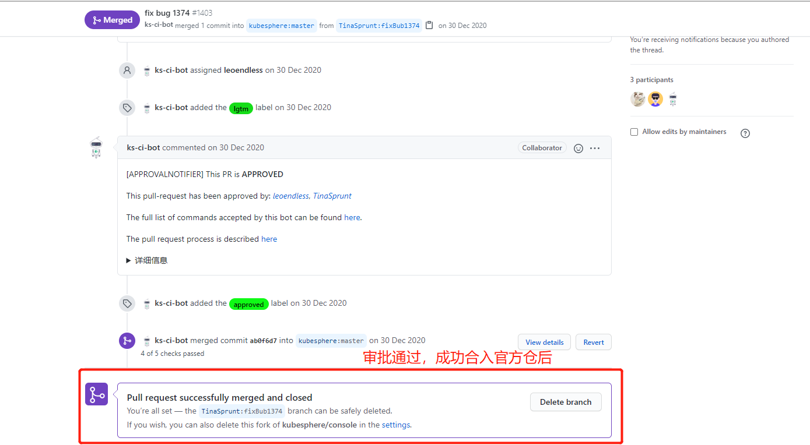

至此一个完整的PR就结束了

## 七、如果不幸 code review 失败，如何重新提交

其实一次成功的几率真的不大，失败是常态平常心就好（大佬的话当我没说，反正我不是大佬哈哈哈哈哈哈）

code review 失败，一般官方会回复你为什么给你审批为失败，然后基于此再改，改好了重新提交

> 重新提交有2种方式:
>   - 1. 关闭此PR,提新的PR (非常不推荐这种方式、这一点都不优雅)
>   - 2. 基于本次PR进行修改
>       - 新增一次commit (会多一次提交记录，小修改不推荐，适合大量修改)
>       - 基于最后一次commit  (推荐这种，小推荐这种修改方式)


小修改的情况，基于本次PR的最后一次commit修改实操流程:
```git
# 本地仓切换到开发分支
git checkout fixBug

# 修改代码balabalabala.... 

# 检查后add代码
git diff 
git add .

# 基于最后一次commit提交代码（出现提交信息编辑页面直接wq保存退出即可）
git commit --amend -s

# 推送代码（如果此前提交有用-f,此时也需要使用-f,务必要在完全确认正确的情况下使用-f）
git push origin
```

此时，已经提交的PR也会自动产生变更，再次进入审核流程

大修改的情况，比如修改很久之前的某次提交，具体参考变基，根据修改量大小，上面2种重新提交方式酌情使用

总结：**核心思想就是把本地仓处理好之后提交到远程仓，PR会随之变化重新进入审批流程。**


